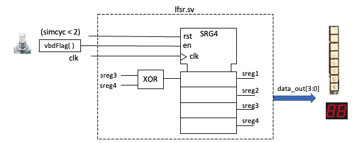
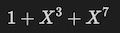
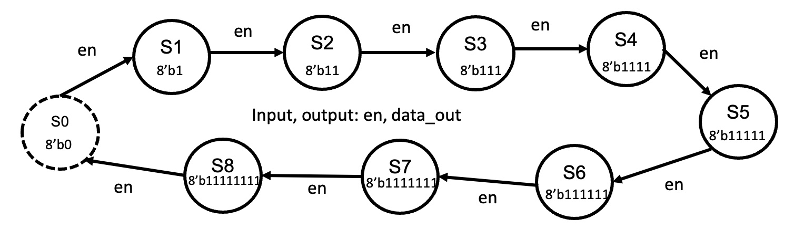
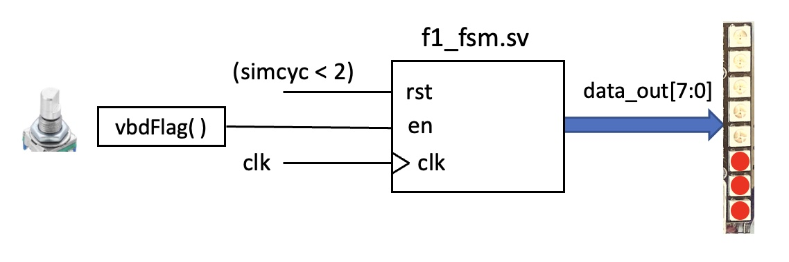
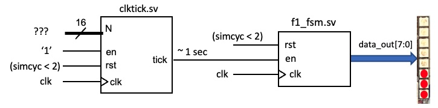
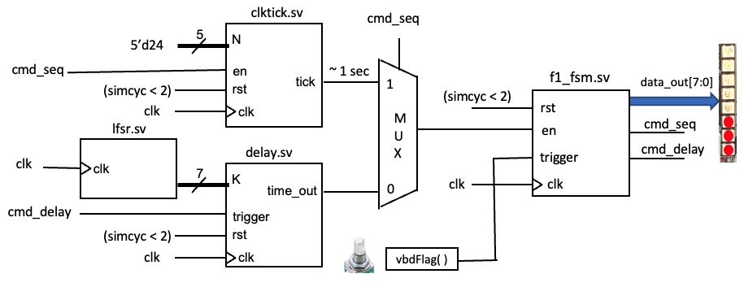

<center>

## EIE2 Instruction Set Architecture & Compiler (IAC)

---
## Lab 3 - Finite State Machines (FSM)

**_Peter Cheung, V1.0 - 2 Nov 2022_**

---

</center>

## Objectives
By the end of this experiment, you should be able to:
* design and test a PRBS generator using a linear feedback shift register (LFSR)
* display 8-bit value on neopixel bar on Vbuddy
* specify a FSM in SystemVerilog
* design a FSM to cycle through the Formula 1 starting light sequence
* understand how the **_clktick.sv_** module works, and calibrate it for 1 sec tick period
* automatically cycle through F1 lights at 1 second interval
* optionally implement the full F1 starting light machine and test your reaction.

Clone this repo to your local disk.  **_Note that Vbuddy.cpp file in this repo is new and is version 1.1._**

---
## Task 1 - 4-bit LFSR and Pseudo Random Binary Sequence
---

**Step 1 - create the component lfsr.sv**

Open the _Lab3-FSM_ folder in VS code. In folder **_task1_**, create the component **__lfsr.sv__** guided by Lecture 4 slide 14. Modify the version in the lecture notes to include an extra enable signal **_en_**, and all four bits of the shift register output are brought out as data_out[3:0].  This is your top-level circuit for this task.

<p align="center">  </p>

**Step 2 - Create the testbench for the LFSR**

Create a testbench to test this 4-bit random number generator.  In your testbench you should use the Vbuddy rotary encoder switch (EC11) and the **_vbdFlag()_** function in one-shot mode (i.e. using **_vbdSetMode(1)_**) to drive the **_en_** signal to step through the random sequence each time you press the switch on Vbuddy.

The four bit output of the random sequence can be shown on the 7-segment display using the **_vbdHex( )_** function as:
```C++
      vbdHex(1, top->data_out & 0xF);
```
Furthermore, you should also display this 4-bit result on the neopixel strip using the **_vdbBar( )_** function:
```C++
      vbdBar(top->data_out & 0xFF);
```
Note that **_vbdBar()_** takes an unsigned 8-bit integer parameter between the value 0 and 255. Therefore you must mask _data_out_ with 0xFF.

**Step 3 - Create the doit.sh script**

Modify the doit.sh file from Lab 2 so that the name of the Device-Under-Test (DUT) is now _lsfr_.  Build your simulation model and test your design.

___

<p align="center">TEST YOURSELF CHALLENGE </p>

___

Based on the **_primitive polynomial_** table in Lecture 4 slide 16, modify **_lfsr.sv_** into a 7-bit (instead of 4-bit) PRBS generator. Test your design.  The 7th order primitive polynomial is:

<p align="center">  </p>

---
## Task 2 - Formula 1 Light Sequence
---

Formula 1 (F1) racing has starting light consists of a series of red lights that turn ON one by one, until all lights are ON. Then all of them turn OFF simultaneously after a random delay.

The goal of this task is to design a FSM that cycles through the sequence according to the following FSM:

<p align="center">  </p>

Based on the notes from Lecture 5, implement this state machine in SystemVerilog to drive the neopixel bar and cycle through the F1 light sequence.  You should use the switch on the rotary switch with the **_vbdFlag()_** function (in mode 1) to drive the _en_ signal as shown below:

<p align="center">  </p>

Write the testbench **_f1_fsm_tb.cpp_**. Compile and test your design.  Each time you press the switch, you should step through the FSM and cycle through the F1 light sequence.

---
## Task 3 - Exploring the **_clktick.sv_** and the **_delay.sv_** modules
---

In Lecture 4 slides 9 & 10, you were introduced to the **_clktick.sv_** module. The interface signals for this module is:

```Verilog
module clktick #(
	parameter WIDTH = 16
)(
  // interface signals
  input  logic             clk,      // clock 
  input  logic             rst,      // reset
  input  logic             en,       // enable signal
  input  logic [WIDTH-1:0] N,     	 // clock divided by N+1
  output logic  		   tick      // tick output
);
```
In the _task3_ folder of this repo, you are provided with the testbench **_clktick_tb.cpp_** and shell script **_clktick.sh_** to build and test the **_clktick_** module.  

The testbench flashes the neopixel strip LEDs on and off at a rate determined by N.  Our goal is to calibrate the circuit (under simulation) to find what value of N gives us a tick period of 1 sec.

Compile and test the **_clktick.sv_** module.  Use the metronome app on Google (just search for metronome) to generate a beat at 60 bpm.  Now adjust the rotary switch to change the flash rate of the neopixels to match the metronome.  The **_vbdValue()_** shown on bottom left of the TFT display is the value for N which gives a tick period of 1 second! (Why?)

The reason that we need to do this calibration is that the Verilator simulation of your design is NOT in real time.  Every computer will work at different rate and therefore takes different amount of time to simulate one cycle of the clock signal _clk_. For a 14" M1 Macbook Pro (my computer), N is around 24 for a tick period of 1 sec (i.e. one tick pulse every second).

___

<p align="center">TEST YOURSELF CHALLENGE </p>

___

Implement the following design by combining **_clkctick.sv_** with **_f1_fsm.sv_** so that the F1 light sequence is cycle through automatically with 1 second delay per state transition.

<p align="center">  </p>

---
##  Task 4 - Full implementation of F1 starting light (OPTIONAL)
---
Complete this task only if you have time.  It is challenging and fun, but also you may find this time consuming.

The follow diagram shows a full version of the F1 light design that combines all many components you have created so far.

<p align="center">  </p>

The **_delay.sv_** module is provided. This module is from  Lecture 5 slides 16 & 17. When trigger is asserted (goes from low to high), it starts counting K clock cycles.  At which time, *time_out* goes high for one clcok cycle. This works in a similar way to clktick.sv, except:
1. Instead of the _en_ signal, we use a _trigger_ signal, which is edge.
2. The FSM can only be triggered again after the _trigger_signal has returned to zero.

You also need to modify **_f1_fsm.sv_** to include a trigger input which kicks off the whole sequence. It also has two additional output signals: 

1. *cmd_seq* which is high during the sequencing of *data_out[7:0]* from 8'b1 to 8'b11111111.  
2. *cmd_delay* which triggers the start of the **_delay.sv_** component.

You may use the 7-bit LFSR from Task 1 to provide the random delay between all LED ON to all LED OFF.

Finally, in the testbench, you may use two new Vbuddy functions added in version 1.1 to measure the reaction time:

1. Once all the lights are OFF after a random delay, the testbench calls **_vbdInitWatch()_** function to start Vbuddy's stop watch.
2. User reacts to the lights going OFF and presses the switch as quickly as possible. **_Vbuddy_** automatically records the elapsed time since the stop watch started.
3. The testbench calls **_vbdElapsed()_** function to read the reaction time in milliseconds.
4. The testbench reports by sending it to Vbuddy as a message on the TFT screen.
